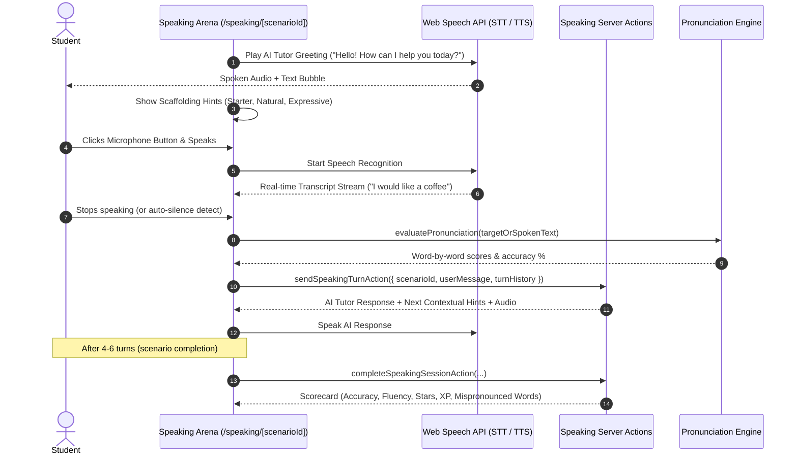

# Phase 8 Design Specification: AI Speaking Partner & Interactive Speech Practice

## 1. Overview & Pedagogical Objective

Speaking English aloud is traditionally the highest-friction and most anxiety-inducing hurdle for ESL learners. Traditional apps either only evaluate isolated single words or provide sterile multiple-choice dialogues where students read and click rather than produce actual speech.

Phase 8 introduces the **AI Speaking Partner & Interactive Speech Practice Hub (`/speaking`)**:
1. **Interactive Conversational AI Tutor ("Sunny")**: A friendly, empathetic AI tutor capable of natural spoken dialogue turn-taking across diverse real-world situations (ordering food, asking for directions, making friends, airport & travel, school life, and open free-talk).
2. **Real-Time Speech-to-Text & Pronunciation Feedback**: Real-time microphone listening via Web Speech API (`useSpeechRecognition`) with immediate token-by-token phonetic evaluation (Green: $\ge 80\%$, Orange/Yellow: $50-79\%$, Red: $< 50\%$), accuracy percentage, and fluency pacing (WPM).
3. **Adaptive Scaffolding & Hint Suggestions ("Gợi ý nói")**: For hesitant learners, Sunny provides 3 levels of contextual answer suggestions (Starter A1, Natural A2-B1, Expressive B2) with Vietnamese translations and audio pronunciation previews so learners never feel stuck.
4. **Resilient AI Dialogue Generation**: Server actions leveraging Google Gemini models with a deterministic offline pedagogical rule engine fallback, guaranteeing 100% reliable responses even without network access or API credentials.
5. **Gamification & Mistake Notebook Integration**: Speaking sessions award stars and XP toward levels, and any mispronounced words can be added directly to the learner's Mistake Notebook (`/mistakes`) for spaced-repetition retention.

---

## 2. Core User Experience & Conversational Flow



---

## 3. Data Contracts & Architecture

### 3.1 Types (`src/types/speaking.ts`)

```typescript
export type CEFRLevel = 'A1' | 'A2' | 'B1' | 'B2';

export interface SpeakingPersona {
  id: string;
  name: string;
  avatar: string;
  role: string;
  accent: 'us' | 'uk' | 'neutral';
  toneVi: string;
}

export interface SpeakingScaffoldingHint {
  level: 'starter' | 'natural' | 'expressive';
  textEn: string;
  textVi: string;
  phoneticHint?: string;
}

export interface SpeakingDialogueTurn {
  id: string;
  sender: 'tutor' | 'student';
  text: string;
  audioUrl?: string;
  accuracyScore?: number;
  wordBreakdown?: Array<{
    word: string;
    isMatch: boolean;
    score: number;
  }>;
  feedbackVi?: string;
  timestamp: string;
}

export interface SpeakingScenario {
  id: string;
  titleVi: string;
  titleEn: string;
  descriptionVi: string;
  level: CEFRLevel;
  icon: string;
  targetTurns: number;
  persona: SpeakingPersona;
  initialMessage: string;
  initialHints: SpeakingScaffoldingHint[];
}

export interface SpeakingSessionResult {
  scenarioId: string;
  personaId: string;
  totalTurns: number;
  overallScore: number;
  pronunciationScore: number;
  fluencyScore: number;
  stars: 1 | 2 | 3;
  xpEarned: number;
  mispronouncedWords: string[];
  turns: SpeakingDialogueTurn[];
}
```

### 3.2 Database Schema (`supabase/migrations/20260912230000_speaking_partner.sql`)

```sql
CREATE TABLE IF NOT EXISTS public.student_speaking_sessions (
  id UUID PRIMARY KEY DEFAULT gen_random_uuid(),
  student_id UUID REFERENCES public.students(id) ON DELETE CASCADE,
  scenario_id TEXT NOT NULL,
  persona_id TEXT NOT NULL DEFAULT 'sunny',
  total_turns INT NOT NULL DEFAULT 0,
  overall_score INT NOT NULL DEFAULT 0,
  pronunciation_score INT NOT NULL DEFAULT 0,
  fluency_score INT NOT NULL DEFAULT 0,
  stars INT NOT NULL DEFAULT 1 CHECK (stars BETWEEN 1 AND 3),
  turns_transcript JSONB NOT NULL DEFAULT '[]'::jsonb,
  mispronounced_words JSONB NOT NULL DEFAULT '[]'::jsonb,
  created_at TIMESTAMPTZ NOT NULL DEFAULT timezone('utc'::text, now()),
  updated_at TIMESTAMPTZ NOT NULL DEFAULT timezone('utc'::text, now())
);

CREATE INDEX IF NOT EXISTS idx_speaking_sessions_student ON public.student_speaking_sessions(student_id);
CREATE INDEX IF NOT EXISTS idx_speaking_sessions_scenario ON public.student_speaking_sessions(scenario_id);

ALTER TABLE public.student_speaking_sessions ENABLE ROW LEVEL SECURITY;
CREATE POLICY "Allow public read speaking sessions" ON public.student_speaking_sessions FOR SELECT USING (true);
CREATE POLICY "Allow public insert speaking sessions" ON public.student_speaking_sessions FOR INSERT WITH CHECK (true);
```

---

## 4. Pure Scoring & Evaluation Engine (`src/lib/speaking-engine.ts`)

1. **Pronunciation Token Alignment**:
   - Compares spoken transcript against reference sentence (or expected response) using Levenshtein distance normalized by word length.
   - Word score threshold: $\ge 80 \implies \text{matched (green)}$, $50-79 \implies \text{fair (yellow)}$, $< 50 \implies \text{needs practice (red)}$.
2. **Fluency & Pacing Calculation**:
   - Calculates Words Per Minute (WPM) based on turn duration:
     - 60–120 WPM: Optimal conversational cadence for primary / intermediate students (100% fluency rating).
     - < 40 WPM: Too slow / hesitant (60–75% fluency).
     - > 180 WPM: Unusually fast or clipped (80% fluency).
3. **Star Rating Allocation**:
   - 3 Stars: Overall score $\ge 85\%$ and pronunciation score $\ge 80\%$.
   - 2 Stars: Overall score $\ge 70\%$.
   - 1 Star: Overall score $< 70\%$ (always encouraging, no 0 stars for kids).

---

## 5. UI Architecture

1. **Speaking Hub (`/speaking`)**:
   - Scenario gallery filterable by CEFR level (A1, A2, B1, B2) and category.
   - Persona switcher: Sunny (Friendly Tutor ☀️), Emma (American Teacher 👩‍🏫), Alex (Adventure Buddy 🎒), Oliver (British Host 🎩).
   - Past session summary card: total speaking minutes, words spoken, average pronunciation accuracy.
2. **Interactive Speaking Arena (`/speaking/[scenarioId]`)**:
   - Animated tutor avatar with visual state cues: Idle, Speaking, Listening, Thinking.
   - Scrollable speech dialogue bubble stream with audio replay buttons for each tutor line.
   - Scaffolding Hints Panel ("Gợi ý câu trả lời") with 3 difficulty choices, Vietnamese translation, and audio preview.
   - Animated audio visualizer waveform on the mic trigger button.
   - Word breakdown badge pill view highlighting phonemes upon user speech submission.
3. **Session Completion Scorecard (`SpeakingPodiumModal.tsx`)**:
   - Star celebration with XP burst.
   - Fluency, accuracy, and vocabulary badges.
   - List of mispronounced words with "Thêm vào Sổ tay từ khó" (Add to Mistake Notebook) button.

---

## 6. Testing Strategy

1. **Unit Tests**:
   - `tests/unit/lib/speaking-engine.test.ts`: pure scoring, WPM estimation, star allocation, token evaluation.
   - `tests/unit/actions/speaking.test.ts`: server action lifecycle (next turn, Gemini fallback, session completion).
   - `tests/unit/components/SpeakingArena.test.tsx`: microphone capture, hints expansion, audio replay, completion trigger.
2. **Typography Policy**:
   - Strict scan ensuring no sub-16px font sizes (`min-font-size-scan.test.ts`).
3. **End-to-End Tests**:
   - `tests/e2e/ai-speaking-partner.spec.ts`: full Playwright flow from `/speaking` selection into `/speaking/[scenarioId]`, mic recording simulation, and scorecard podium display.
