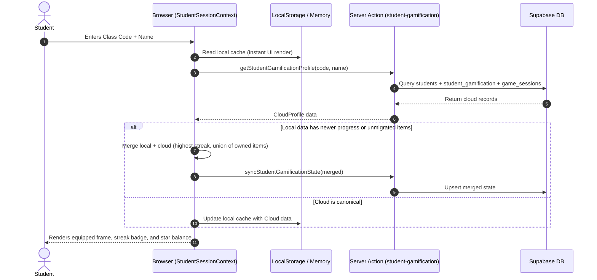

# Technical Design Specification: Cloud-Synced Student Gamification & Cross-Device Profile (Sub-project 8)

**Feature Branch**: `feat/cloud-synced-student-gamification`  
**Date**: 2026-09-12  
**Status**: Ready for Implementation Plan  

---

## 1. Executive Summary & Goals

In previous phases, GameHub successfully launched **Mini-games**, **Teacher Classroom Management**, **Assignments**, and **Gamification 2.0** (Daily Streaks, Quests, and Rewards Shop). However, student gamification states (streak counters, streak freezes, quest progress, owned shop items, equipped frames, and titles) currently reside exclusively in browser `localStorage`.

### Problem Statement
1. **Device Lock-in & Data Loss**: If a student switches devices (e.g. from school computer to home phone/tablet) or clears their browser cache, all streak milestones, purchases, equipped avatar frames, and quest progress are lost.
2. **Teacher Invisibility**: Teachers cannot see students' streaks, equipped items, or quest activity in the admin dashboard.
3. **Multi-device Inconsistency**: A student cannot start homework on desktop and complete daily quests on mobile without diverging local states.

### Objectives
1. **Cloud Persistence with Zero Sign-in Friction**: Keep the frictionless "Class Code + Student Name" login while persisting all gamification states (streaks, freezes, shop inventory, equipped frames/titles, quests) to Supabase.
2. **Dual-Layer Fallback (Cloud-First + Local Cache)**: Instant client-side hydration from cache to prevent UI flash, with seamless background cloud synchronization and offline/guest resiliency.
3. **One-Time Migration**: Automatically reconcile and migrate existing `localStorage` data to the cloud upon the student's next login so no existing progress is lost.
4. **Teacher Classroom Insight**: Render student streaks, levels, and equipped badges/titles inside the Teacher Classroom view (`/admin/dashboard/classes/[classId]`).

---

## 2. Architecture & Data Model

### 2.1 Database Schema (`supabase/migrations/20260912160000_student_gamification.sql`)

A dedicated `student_gamification` table establishes a 1-to-1 relationship with `students`:

```sql
CREATE TABLE IF NOT EXISTS public.student_gamification (
  id UUID PRIMARY KEY DEFAULT gen_random_uuid(),
  student_id UUID NOT NULL UNIQUE REFERENCES public.students(id) ON DELETE CASCADE,
  streak_state JSONB NOT NULL DEFAULT '{
    "currentStreak": 0,
    "longestStreak": 0,
    "lastActiveDate": "",
    "freezeCount": 1,
    "totalActiveDays": 0,
    "unlockedMilestones": []
  }'::jsonb,
  inventory JSONB NOT NULL DEFAULT '{
    "ownedItemIds": [],
    "equippedFrameId": null,
    "equippedTitleId": null,
    "spentStars": 0,
    "bonusStars": 0
  }'::jsonb,
  quests JSONB NOT NULL DEFAULT '[]'::jsonb,
  created_at TIMESTAMPTZ NOT NULL DEFAULT timezone('utc'::text, now()),
  updated_at TIMESTAMPTZ NOT NULL DEFAULT timezone('utc'::text, now())
);

-- Index for instant single-record student lookups
CREATE INDEX IF NOT EXISTS idx_student_gamification_student_id 
  ON public.student_gamification(student_id);

-- Row Level Security
ALTER TABLE public.student_gamification ENABLE ROW LEVEL SECURITY;

-- Teachers can view gamification records of students in their classrooms
CREATE POLICY "Teachers can view student gamification in their classrooms"
ON public.student_gamification
FOR SELECT
TO authenticated
USING (EXISTS (
  SELECT 1 FROM public.students s
  JOIN public.classrooms c ON c.id = s.classroom_id
  WHERE s.id = student_gamification.student_id AND c.teacher_id = auth.uid()
));

-- Automatic updated_at trigger
DROP TRIGGER IF EXISTS set_student_gamification_updated_at ON public.student_gamification;
CREATE TRIGGER set_student_gamification_updated_at
  BEFORE UPDATE ON public.student_gamification
  FOR EACH ROW
  EXECUTE FUNCTION public.handle_updated_at();
```

---

## 3. Server Actions & Backend Services

### 3.1 `src/app/actions/student-gamification.ts`

To respect student authentication boundaries (students use classCode + name rather than Supabase Auth credentials), student mutations and queries are served through Server Actions using `createAdminClient()` with strict classroom verification:

```typescript
export interface CloudStudentProfile {
  studentId: string;
  totalStars: number;
  streakState: StreakState;
  inventory: StudentInventory;
  quests: Quest[];
}

// 1. Fetch complete student profile
export async function getStudentGamificationProfile(
  classCode: string,
  studentName: string
): Promise<{ success: boolean; data?: CloudStudentProfile; error?: string }>;

// 2. Sync / Upsert gamification state
export async function syncStudentGamificationState(
  classCode: string,
  studentName: string,
  payload: {
    streakState?: StreakState;
    inventory?: StudentInventory;
    quests?: Quest[];
  }
): Promise<{ success: boolean; error?: string }>;

// 3. Purchase shop item on Cloud
export async function purchaseShopItemAction(
  classCode: string,
  studentName: string,
  itemId: string
): Promise<{ success: boolean; inventory?: StudentInventory; remainingStars?: number; error?: string }>;

// 4. Equip / Unequip item on Cloud
export async function equipShopItemAction(
  classCode: string,
  studentName: string,
  itemId: string,
  category: 'frame' | 'title'
): Promise<{ success: boolean; inventory?: StudentInventory; error?: string }>;

// 5. Claim quest reward on Cloud
export async function claimQuestRewardAction(
  classCode: string,
  studentName: string,
  questId: string
): Promise<{ success: boolean; quests?: Quest[]; bonusStars?: number; error?: string }>;
```

---

## 4. Frontend & Client-Side Synchronization

### 4.1 Client Flow & Reconciliation Logic (`StudentSessionContext.tsx`)



### 4.2 Handling Guest / Anonymous Mode
- When `isAnonymous = true` (playing without class code), all functions cleanly fall back to local `localStorage` without attempting server network calls.
- When an anonymous user later joins a class, their local session items can optionally be prompted or carried into their new student profile.

---

## 5. Teacher Dashboard Integration

### 5.1 Updates to `/admin/dashboard/classes/[classId]`
- In `dashboard/ClassOverview.tsx` and `dashboard/StudentDetail.tsx`:
  - Fetch `student_gamification` alongside student records in `getClassDetails(classId)`.
  - Display **Active Streak Flame** (e.g. `🔥 5 ngày`), **Equipped Title**, and **Avatar Frame** next to each student's name in the classroom roster.
  - Show a class leaderboard metric: *"Học sinh có chuỗi học tập dài nhất"* (Top Streak in Class).

---

## 6. Testing & Quality Assurance Plan

1. **Database Migration Verification**:
   - Run migration script against Supabase instance.
   - Verify table creation, indexes, foreign keys, triggers, and RLS policies.
2. **Server Action Unit Tests** (`tests/unit/actions/student-gamification.test.ts`):
   - Test `getStudentGamificationProfile` with valid, nonexistent, and inactive classes.
   - Test atomic purchases: insufficient stars, duplicate purchases, successful purchase.
   - Test quest claims: already claimed, uncompleted, successful claim.
3. **Cross-Device Sync Simulation**:
   - Simulate Client A buying a frame and incrementing streak.
   - Client B joining the same class + name immediately receives the updated frame and streak.
4. **Backward Compatibility**:
   - Test existing localStorage items correctly merging into newly created cloud records without data loss.
5. **E2E Playwright Test**:
   - Student joins class, buys an item from shop, refreshes, verifies item remains equipped across browser reloads.

---

## 7. Delivery Milestones

1. **Step 1**: Database migration file and database types update (`npm run gen:types`).
2. **Step 2**: Server actions for gamification profile, purchases, equips, and quest claims.
3. **Step 3**: `StudentSessionContext` and `use-game-tracking` cloud integration with dual-layer fallback.
4. **Step 4**: Teacher classroom roster display with streaks and equipped items.
5. **Step 5**: Full unit and end-to-end test suite validation.
