# Phase 6 Design Specification: Curriculum Roadmap & Quest Journey

## 1. Overview & Business Context

GameHub already offers 20 diverse interactive mini-games, an extensive grammar and tense suite, cloud-synced student profiles, daily streaks, quests, shop items, an SRS mistake notebook, and a live classroom arena. However, all mini-games currently exist as isolated choices in catalog lists. Learners lack a guided, cohesive progression model that structures vocabulary, phonics, sentence construction, and professional grammar into a motivating, gamified adventure.

Phase 6 introduces the **Curriculum Roadmap & Quest Journey** — an interactive, map-based learning adventure (similar to Duolingo and Khan Academy) that organizes GameHub's educational content into sequential, CEFR-aligned worlds.

### Key Objectives
1. **Curated Progression**: 4 distinct educational worlds from Pre-A1 to B2/Workplace Professional English, incorporating all 20 mini-games and grammar modules.
2. **Pedagogical Star Rating**: Clear mastery criteria (1 star for >= 60%, 2 stars for >= 80%, 3 stars for 100%) that unlock subsequent nodes and award bonus stars/XP.
3. **Boss Checkpoint Challenges**: Comprehensive multi-skill tests at the end of each world that gate progression to the next world.
4. **Seamless Hybrid Sync**: Instant gameplay for anonymous learners via localStorage with automatic cloud synchronization to Supabase when joining a classroom session.
5. **Teacher Insights**: Class-level roadmap analytics allowing teachers to identify learning bottlenecks, completion rates, and average star ratings per node.

---

## 2. Learning Worlds & Nodes Architecture

Content is structured hierarchically: **World -> Stage / Node -> Educational Target & Game Session**.

```mermaid
flowchart LR
    subgraph W1 ["World 1: Explorer (Pre-A1)"]
        W1_N1["1. Alphabet Phonics"] --> W1_N2["2. Numbers 1-10"] --> W1_N3["3. Color Swatches"] --> W1_Boss["10. Explorer Boss Checkpoint"]
    end
    subgraph W2 ["World 2: Word Builder (A1)"]
        W2_N1["1. Animals Flashcard"] --> W2_N2["2. Food Spelling"] --> W2_N3["3. Memory Match"] --> W2_Boss["12. Builder Boss Checkpoint"]
    end
    subgraph W3 ["World 3: Grammar & Logic (A2)"]
        W3_N1["1. Present Simple"] --> W3_N2["2. Sentence Builder"] --> W3_N3["3. Grammar Detective"] --> W3_Boss["15. Mastery Boss Checkpoint"]
    end
    subgraph W4 ["World 4: Workplace Pro (B1-B2)"]
        W4_N1["1. Tech Vocab Defense"] --> W4_N2["2. Standup Speaking"] --> W4_N3["3. DevOps Challenge"] --> W4_Boss["15. Pro Certification Boss"]
    end

    W1_Boss -->|Pass >= 80%| W2_N1
    W2_Boss -->|Pass >= 80%| W3_N1
    W3_Boss -->|Pass >= 80%| W4_N1
```



### Static Curriculum Dataset: `src/data/curriculum/worlds.json`
Each node contains:
- `id`: string (e.g. "w1-n1")
- `worldId`: string (e.g. "world-1")
- `order`: number
- `titleVi`, `titleEn`: string
- `descriptionVi`, `descriptionEn`: string
- `gameType`: string (References game id in games.json, e.g. 'flashcard', 'spelling', 'tenses')
- `gameRoute`: string (e.g. '/games/flashcard' or '/tenses')
- `gameParams`: Record<string, any> (e.g. { topic: 'animals', wordLimit: 10 })
- `targetScore`: number (Minimum score to pass, default 60%)
- `xpReward`: number (e.g. 50 XP)
- `bonusStars`: number (Extra shop stars for 3-star completion)
- `isBossCheckpoint`: boolean (Gates progression to next world)
- `prerequisites`: string[] (Node IDs required to unlock this node)

Each world contains:
- `id`: string
- `order`: number
- `titleVi`, `titleEn`: string
- `levelBadge`: string ('Pre-A1', 'A1', 'A2', 'B1-B2')
- `description`: string
- `themeColor`: string ('emerald', 'sky', 'violet', 'amber')
- `icon`: string
- `minStarsToUnlock`: number
- `nodes`: RoadmapNode[]

---

## 3. Database Schema & Migration

### Migration: `supabase/migrations/20260912210000_curriculum_roadmap.sql`

```sql
CREATE TABLE IF NOT EXISTS public.student_roadmap_progress (
  id UUID PRIMARY KEY DEFAULT gen_random_uuid(),
  student_id UUID NOT NULL REFERENCES public.students(id) ON DELETE CASCADE,
  world_id TEXT NOT NULL,
  node_id TEXT NOT NULL,
  stars INTEGER NOT NULL CHECK (stars >= 0 AND stars <= 3),
  high_score INTEGER NOT NULL DEFAULT 0,
  attempts INTEGER NOT NULL DEFAULT 1,
  is_completed BOOLEAN NOT NULL DEFAULT false,
  completed_at TIMESTAMPTZ,
  created_at TIMESTAMPTZ NOT NULL DEFAULT timezone('utc'::text, now()),
  updated_at TIMESTAMPTZ NOT NULL DEFAULT timezone('utc'::text, now()),
  CONSTRAINT uq_student_roadmap_node UNIQUE (student_id, node_id)
);

CREATE INDEX IF NOT EXISTS idx_roadmap_student_id ON public.student_roadmap_progress(student_id);
CREATE INDEX IF NOT EXISTS idx_roadmap_world_node ON public.student_roadmap_progress(world_id, node_id);

ALTER TABLE public.student_roadmap_progress ENABLE ROW LEVEL SECURITY;

CREATE POLICY "Teachers can view student roadmap progress in their classrooms"
ON public.student_roadmap_progress
FOR SELECT
TO authenticated
USING (EXISTS (
  SELECT 1 FROM public.students s
  JOIN public.classrooms c ON c.id = s.classroom_id
  WHERE s.id = student_roadmap_progress.student_id AND c.teacher_id = auth.uid()
));
```

---

## 4. Business Logic & Server Actions

### Pure Domain Engine: `src/lib/roadmap.ts`
1. **Star Calculation**:
   - `percentage = Math.floor((score / totalQuestions) * 100)`
   - `percentage >= 100 -> 3 stars`
   - `percentage >= 80 -> 2 stars`
   - `percentage >= 60 -> 1 star`
   - `percentage < 60 -> 0 stars (Failed)`
2. **Node Unlock Resolution**:
   - First node in World 1 is always unlocked.
   - Any node is unlocked if ALL its prerequisites have `stars >= 1`.
   - A World is unlocked if the previous World's Boss Checkpoint is completed (`stars >= 2`) AND total accumulated stars meet `minStarsToUnlock`.

### Server Actions: `src/app/actions/roadmap.ts`
- **`getStudentRoadmapProgressAction(classCode, studentName)`**:
  - Validates student existence.
  - Queries all `student_roadmap_progress` records.
  - Returns map of completed nodes, star counts, and highest scores.
- **`recordRoadmapNodeCompletionAction(classCode, studentName, payload)`**:
  - Calculates stars from score/totalQuestions.
  - Upserts into `student_roadmap_progress` (retaining higher stars and high scores).
  - Updates gamification XP and bonus stars in `student_gamification`.
  - Checks and updates daily quests.
- **`syncLocalRoadmapProgressAction(classCode, studentName, localEntries)`**:
  - Merges offline/localStorage progress upon class join.
- **`getClassRoadmapOverviewAction(classroomId)`**:
  - Calculates class-wide world progress distribution, completion percentages, and top challenging nodes.

---

## 5. User Experience & Visual Interface

### Main Journey Route: `/roadmap`
1. **Top HUD Bar**:
   - Total Stars counter with golden star badge.
   - World Selector Tabs (Pre-A1, A1, A2, B1-B2).
   - Student session badge.
2. **Winding S-Curve Island Map**:
   - SVG curved path connecting nodes.
   - Node status styles: Completed (emerald/gold with 1-3 stars), Active/Next (pulsing glow), Locked (muted gray with lock icon), Boss Checkpoint (enlarged node with crown badge).
3. **Node Preview Modal (`RoadmapNodeModal.tsx`)**:
   - Target skill, game type, past stars & high score, rewards preview, and 'Chơi ngay' CTA button.
   - Routes to game with `?roadmapNode=w1-n1`.
4. **Post-Game Integration**:
   - Game result screen detects roadmap context, displays stars earned animation, and provides 'Tiếp tục lộ trình' button.

### Teacher Management View: `src/components/class/ClassRoadmapOverview.tsx`
- Embedded in Classroom details page (`/admin/classes/[id]`).
- World completion progress bars and per-student roadmap matrix.

---

## 6. Testing Strategy

1. **Unit Tests (`tests/unit/lib/roadmap.test.ts`)**:
   - Verify star calculation threshold boundaries (59%, 60%, 79%, 80%, 100%).
   - Verify prerequisite unlock chains and boss checkpoint gating.
2. **Server Action Tests (`tests/unit/actions/roadmap.test.ts`)**:
   - Verify database upserting, non-regression on lower scores, and gamification rewards triggering.
3. **End-to-End Tests (`tests/e2e/curriculum-roadmap.spec.ts`)**:
   - Full flow: navigate to `/roadmap`, verify unlocked node, play stage, finish game, verify stars recorded and next node unlocked.
