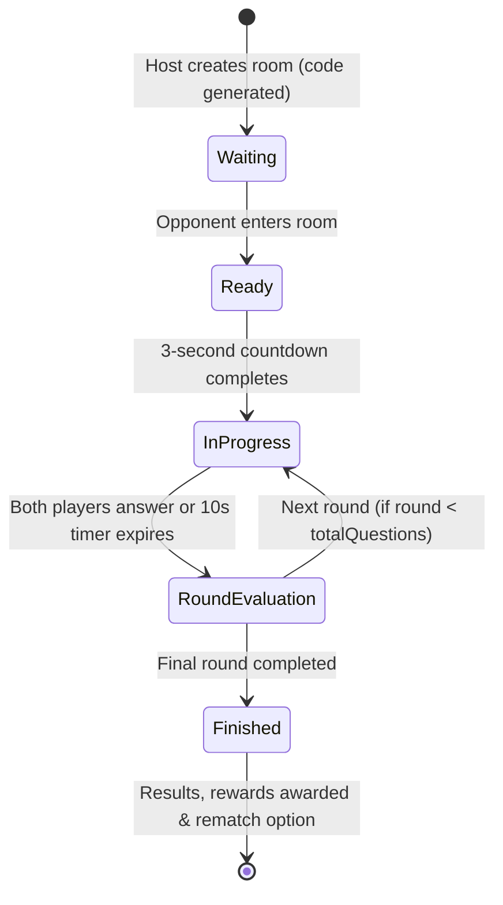

# Phase 7 Design Specification: Realtime Student 1v1 Duels & Class Leaderboards

## 1. Overview & Pedagogical Objective

Phase 6 established GameHub's Curriculum Roadmap, providing structured solo learning across 4 CEFR worlds. However, educational games achieve their highest engagement, retention, and peer-to-peer motivation through **real-time competitive social learning**.

Phase 7 delivers **Realtime Student 1v1 Duels & Leaderboards**:
1. **Zero-Friction 1v1 Duels (`/duel`)**: Any student can create a quick duel room, share a 6-character code or link with a classmate, or enter a quick-match matchmaking queue.
2. **Speed & Accuracy Real-Time Scoring**: 5 to 7 rapid-fire vocabulary and grammar rounds (10s per round) with live opponent score/progress indicators powered by Supabase Realtime broadcast and Postgres state synchronization.
3. **Win/Loss Gamification Rewards**: Victory rewards bonus XP and stars for the Rewards Shop, with tie-breakers decided by answer speed.
4. **Classroom & Global Leaderboards (`/leaderboard`)**: Weekly and all-time rankings filtered by classroom or global platform, tracking weekly stars, total XP, current streaks, and PvP win rates.

---

## 2. Realtime Duel Lifecycle & State Machine



### Protocol & Synchronization
- **Supabase Realtime Channel**: `duel:{duelId}`
- **Events**:
  - `player_joined`: Opponent arrives, triggers ready countdown.
  - `answer_submitted`: Broadcasts opponent's answer status and current score.
  - `round_next`: Synchronizes synchronized transition to the next question.
  - `duel_completed`: Finalizes scores and updates winner profile.

---

## 3. Database Schema & Migrations

### Migration: `supabase/migrations/20260912220000_pvp_duels.sql`

```sql
-- Migration: Realtime Student 1v1 Duels & Matchmaking

CREATE TABLE IF NOT EXISTS public.pvp_duels (
  id UUID PRIMARY KEY DEFAULT gen_random_uuid(),
  code VARCHAR(8) NOT NULL UNIQUE,
  topic TEXT NOT NULL DEFAULT 'mixed',
  questions JSONB NOT NULL DEFAULT '[]'::jsonb,
  status TEXT NOT NULL DEFAULT 'waiting' CHECK (status IN ('waiting', 'ready', 'in_progress', 'finished', 'cancelled')),
  
  -- Player 1 (Creator / Host)
  player1_name TEXT NOT NULL,
  player1_avatar TEXT NOT NULL DEFAULT '🦊',
  player1_score INT NOT NULL DEFAULT 0,
  player1_answers JSONB NOT NULL DEFAULT '[]'::jsonb,
  
  -- Player 2 (Challenger)
  player2_name TEXT,
  player2_avatar TEXT DEFAULT '🐼',
  player2_score INT NOT NULL DEFAULT 0,
  player2_answers JSONB NOT NULL DEFAULT '[]'::jsonb,
  
  current_question_index INT NOT NULL DEFAULT 0,
  winner_name TEXT,
  created_at TIMESTAMPTZ NOT NULL DEFAULT timezone('utc'::text, now()),
  updated_at TIMESTAMPTZ NOT NULL DEFAULT timezone('utc'::text, now())
);

-- Indexes
CREATE INDEX IF NOT EXISTS idx_pvp_duels_code ON public.pvp_duels(code);
CREATE INDEX IF NOT EXISTS idx_pvp_duels_status ON public.pvp_duels(status);

-- RLS
ALTER TABLE public.pvp_duels ENABLE ROW LEVEL SECURITY;

CREATE POLICY "Allow public read duels"
  ON public.pvp_duels FOR SELECT
  USING (true);

CREATE POLICY "Allow public insert duels"
  ON public.pvp_duels FOR INSERT
  WITH CHECK (true);

CREATE POLICY "Allow public update duels"
  ON public.pvp_duels FOR UPDATE
  USING (true)
  WITH CHECK (true);
```

---

## 4. Pure Domain Engine: `src/lib/duel-scoring.ts`

- **Speed-Decay Duel Scoring**:
  - Correct Answer Base: 100 points
  - Speed Bonus: $\lfloor 100 \times (1 - \text{elapsedMs} / 10000) \rfloor$ (up to +100 points)
  - Streak Bonus: $+20$ points per consecutive correct answer
  - Incorrect / Timeout: 0 points
- **Match Winner Resolution**:
  - If `score1 > score2` $\rightarrow$ Player 1 wins
  - If `score2 > score1` $\rightarrow$ Player 2 wins
  - If `score1 === score2` $\rightarrow$ Tie / Draw

---

## 5. Server Actions: `src/app/actions/duels.ts` & `src/app/actions/leaderboards.ts`

- **`createDuelAction({ playerName, avatar, topic, questionCount })`**: Generates 6-character room code, pulls random curated questions from Word Bank / curriculum, creates room in `waiting` status.
- **`joinDuelAction({ code, playerName, avatar })`**: Validates room existence and availability, assigns Player 2, transitions status to `ready`.
- **`submitDuelAnswerAction({ duelId, playerRole, questionIndex, isCorrect, elapsedMs })`**: Calculates round score with speed decay, appends to player answers, updates total score. If both answered, advances question index or finishes match.
- **`getClassLeaderboardAction(classCode)`**: Queries students in classroom, aggregates weekly stars, XP, streaks, and duel wins.
- **`getGlobalLeaderboardAction(timeframe: 'weekly' | 'all')`**: Returns top 20 learners platform-wide.

---

## 6. User Interface & Route Architecture

- **Main Duel Hub (`/duel`)**:
  - "Tạo phòng thách đấu" (Create private match with invite link/code)
  - "Tham gia bằng mã" (Join via 6-character code)
  - "Tìm trận nhanh" (Random matchmaking)
- **Duel Battle Arena (`/duel/[code]`)**:
  - Top split bar: Player 1 VS Player 2 with real-time score counters, animated avatars, and streak fire badges.
  - Center: Rapid 10s countdown timer with animated circular progress bar.
  - Question card with 4 clickable answer buttons, instant audio feedback (correct chime, wrong thud).
  - Round summary & Winner podium screen with celebratory confetti and rematch CTA.
- **Leaderboards Hub (`/leaderboard`)**:
  - Filter tabs: "Lớp của tôi" (My Class) and "Bảng vàng toàn trường" (Global Top 20).
  - Top 3 Podium (Gold, Silver, Bronze trophy cards) + ranked list showing avatar frames, badges, and total stars.

---

## 7. Testing Strategy
- Pure scoring unit tests (`tests/unit/lib/duel-scoring.test.ts`)
- Duel server action unit tests (`tests/unit/actions/duels.test.ts`)
- Leaderboard aggregation tests (`tests/unit/actions/leaderboards.test.ts`)
- Playwright E2E duel flow (`tests/e2e/student-pvp-duels.spec.ts`)
