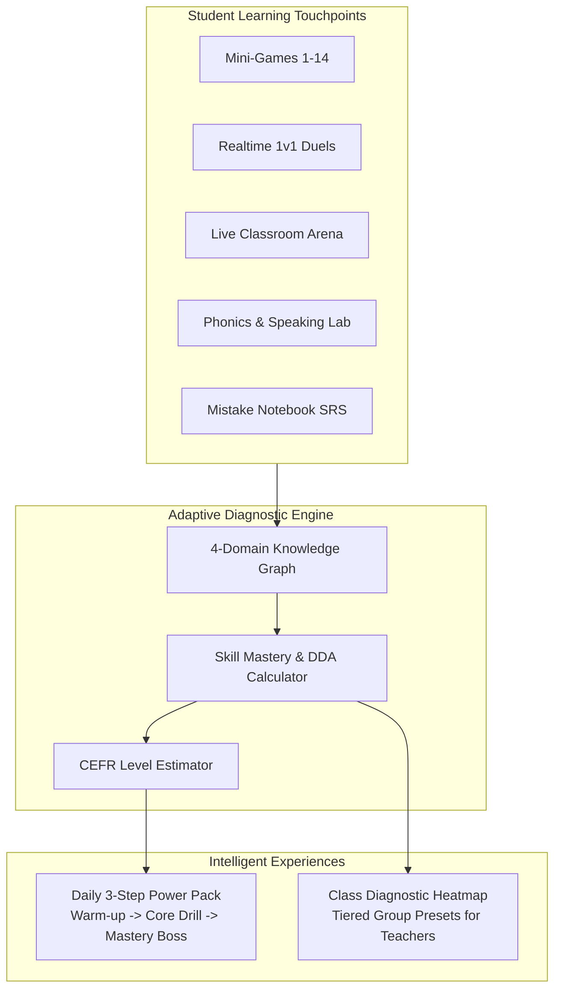

# Phase 15: Adaptive Diagnostic Knowledge Graph & Differentiated Learning Pathways Design

## 1. Context & Motivation

In English as a Second Language (ESL) education—especially for elementary and middle school students in Vietnam—learners do not advance at uniform rates. A student might excel in lexical vocabulary recognition (e.g. flashcards, spelling) but struggle significantly with ending consonant phonics (`/s/`, `/k/`, `/t/`) or grammatical subject-verb agreements in simple sentences.

Traditional one-size-fits-all digital assignments lead to:
1. Boredom for advanced students repeating elementary drills.
2. Frustration for struggling students overwhelmed by complex sentence builders.
3. Teacher burnout from manually auditing mistake logs and creating tiered worksheets for heterogeneous classes.

**Phase 15** establishes an **Adaptive Diagnostic Knowledge Graph & Differentiated Learning Engine** that bridges all previous GameHub modules:
- Tracks fine-grained student competencies across 4 foundational domains: **Phonics**, **Vocabulary**, **Grammar**, and **Listening**.
- Computes real-time **Skill Mastery Indexes (0–100%)** and estimates **CEFR proficiency (Pre-A1, A1.1, A1.2, A2.1, A2.2)**.
- Delivers a personalized **Daily 3-Step Power Pack (Gói Bài Tập Tăng Tốc Cá Nhân)** tailored to each student's current knowledge gaps.
- Equips teachers with a **Class Diagnostic Heatmap & Group Differentiation Matrix** (`/admin/diagnostics`) to effortlessly cluster classes into Support (Cần phụ đạo), Target (Đạt chuẩn), and Advanced (Nâng cao) cohorts with targeted 1-click homework presets.

---

## 2. Core Architecture & Skill Taxonomy

### 2.1 The 4 Foundational Domains & Skill Nodes

1. **Phonics & Pronunciation (`phonics`)**:
   - `ph-ending-sounds`: Bật âm đuôi (`/s/`, `/k/`, `/t/`, `/d/`).
   - `ph-vowels-diphthongs`: Nguyên âm ngắn vs dài (`/iː/` vs `/ɪ/`, `/æ/` vs `/e/`).
   - `ph-fricatives-clusters`: Âm xát và cụm phụ âm (`/θ/`, `/ð/`, `/ʃ/`, `/str/`).

2. **Vocabulary Acquisition (`vocabulary`)**:
   - `voc-everyday-basics`: Đồ dùng học tập, gia đình, màu sắc, số đếm (Pre-A1).
   - `voc-animals-nature`: Động vật, thiên nhiên, thời tiết (A1.1).
   - `voc-actions-jobs`: Nghề nghiệp, hoạt động hằng ngày, sở thích (A1.2 - A2).

3. **Grammar & Syntax (`grammar`)**:
   - `grm-word-order`: Trật tự từ trong câu đơn (S-V-O).
   - `grm-present-simple`: Thì hiện tại đơn và ngôi thứ 3 số ít (`he/she/it + V-s/es`).
   - `grm-parts-of-speech`: Phân biệt danh từ, động từ, tính từ, giới từ chỉ nơi chốn.

4. **Listening & Reflex (`listening`)**:
   - `lis-sound-discrim`: Phân biệt âm thanh và nhận diện từ vựng qua audio.
   - `lis-sentence-comprehension`: Nghe hiểu câu ngắn và chọn hình ảnh/đáp án phù hợp.

---

## 3. Dynamic Difficulty Adjustment (DDA) Algorithm

To maintain an optimal state of flow (Zone of Proximal Development):
- If student accuracy on a skill node is $\ge 85\%$ in recent sessions:
  - Difficulty Multiplier is scaled to `1.2` (Chế độ Thử Thách: Giảm 20% thời gian đếm ngược, thêm từ gây nhiễu).
- If student accuracy is $60\% - 84\%$:
  - Difficulty Multiplier is `1.0` (Chế độ Tiêu Chuẩn).
- If student accuracy is $< 60\%$ or has high mistake velocity:
  - Difficulty Multiplier is `0.8` (Chế độ Hỗ Trợ: Bật gợi ý âm thanh mẫu, giảm số lượng lựa chọn từ 4 xuống 3, làm nổi bật từ khóa).

---

## 4. Student Experience: Daily 3-Step Power Pack

The student accesses their adaptive daily mission (`/roadmap` or `/learn/adaptive`):
1. **Step 1: Khởi Động Tinh Gọn (3 mins)** - 5 flashcards or pronunciation phoneme drills targeting their lowest-scoring skill node.
2. **Step 2: Luyện Tập Cốt Lõi (5 mins)** - The optimal mini-game matched to their primary growth area with dynamic difficulty.
3. **Step 3: Chinh Phục Đỉnh Cao (2 mins)** - Boss speed challenge (3 quick questions) unlocking bonus streak flames (+15 EXP, Star Coin).

Visualized with an interactive progress circle, tactile completion checkmarks, and celebratory confetti.

---

## 5. Teacher Experience: Class Diagnostic Heatmap (`/admin/diagnostics`)

Located in the Admin Navigation (`AI Co-Pilot` / `Diagnostics`):
1. **Domain Overview Radar**: Average class proficiency across the 4 domains.
2. **Student Skill Heatmap Table**: Color-coded cell matrix:
   - 🟢 Green ($\ge 80\%$): Đã làm chủ (Mastered).
   - 🟡 Yellow ($50\% - 79\%$): Đang tiến bộ (Progressing).
   - 🔴 Red ($< 50\%$): Cần can thiệp (Attention Needed).
3. **1-Click Differentiated Grouping**:
   - Button: *Tạo bài tập phụ đạo cho nhóm Yếu Âm Đuôi* (pre-configures Live Arena or Word Bank assignment with 1 click).

---

## 6. Strict Kid-Friendly Typography Policy

- Strictly minimum 16px font size throughout student and parent components.
- Zero tolerance for `text-xs`, `text-sm`, `text-[10px]`, `text-[12px]`, `text-[14px]`.
- WCAG AA high contrast ratios.

---

## 7. Verification Strategy

1. **Unit Tests (Vitest)**:
   - DDA calculation given varying student error logs.
   - 4-Domain skill mastery score calculation and CEFR level estimation.
   - Daily 3-step power pack generation matching diagnosed weak nodes.
2. **Component Tests (Vitest + Testing Library)**:
   - `AdaptivePowerPack.tsx`: renders all 3 steps, handles step advancement, verifies strict $\ge 16$px typography.
   - `ClassSkillHeatmap.tsx`: displays domain tabs, student rows, and tier badges.
3. **Playwright E2E Tests**:
   - Teacher route protection on `/admin/diagnostics`.
   - Student adaptive journey rendering with kid-friendly font audits.
4. **Quality Gates**:
   - TypeScript 5 (`npx tsc --noEmit`): 0 errors, 0 `any`.
   - ESLint (`npm run lint`): 0 warnings/errors.
   - Full Vitest suite (`npm run test:run`): 100% passing.
   - Turbopack production build (`npm run build`): successful build.
