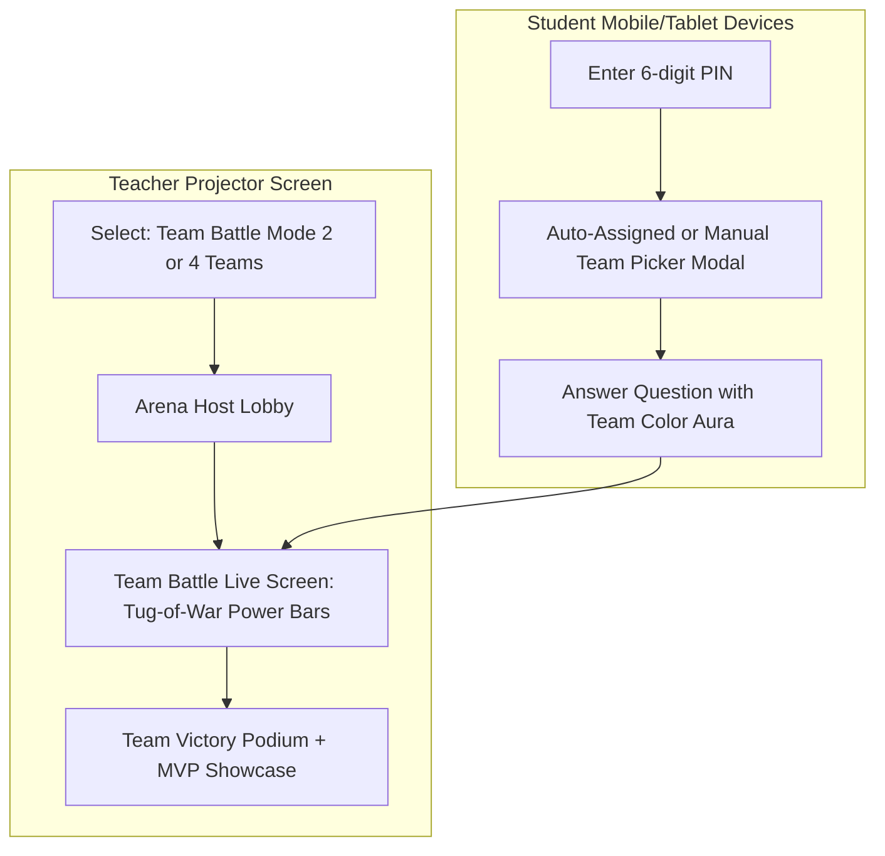

# Phase 16: Classroom Team Battles & Guild Tournaments Design

## 1. Context & Educational Rationale

In classroom ESL environments (elementary and secondary schools in Vietnam, language centers such as VUS, ILA, Apollo), solo competitive games can cause anxiety or disengagement among shy or lower-performing students. Conversely, **Team-Based Cooperative Competition (Đại Chiến Chia Đội)** turns the classroom into an electrifying, collaborative arena:
1. **Peer Support & Low-Stakes Engagement**: When points roll up to a shared team score, individual errors do not result in public embarrassment, encouraging risk-taking in English pronunciation and spelling.
2. **Team Combo Synergy**: When multiple members of a team answer correctly in the same question window, a **Team Combo Multiplier (+10% to +30%)** is activated.
3. **Mascot Identity & Belonging**: Students bond around 4 vivid team mascots:
   - 🔴 **Red Dragons (Rồng Lửa)** - `#EF4444`, 🐉
   - 🔵 **Blue Eagles (Đại Bàng Biển)** - `#3B82F6`, 🦅
   - 🟢 **Green Sharks (Cá Mập Xanh)** - `#10B981`, 🦈
   - 🟡 **Golden Tigers (Cọp Vàng)** - `#F59E0B`, 🐯
4. **Celebration of Individual & Team Growth**: The final victory podium honors the Winning Team while spotlighting the **Team MVP (Chiến Binh Xuất Sắc Nhất Đội)** for each group.

---

## 2. Architecture & Flow Diagram

---

## 3. Team Division & Scoring Algorithms

### 3.1 Team Allocation
- **Auto-Balance Mode**: As students join the room with PIN, the system round-robins them across active teams ($N$ teams: 2 for 1v1 Team Clash, or 4 for Quad Tournament) to guarantee equal headcounts.
- **Manual Choice Mode**: Students pick their desired mascot card on their mobile screen, with capacity caps ($+1$ max variance per team).

### 3.2 Team Scoring & Combo Multipliers
- $\text{Score}_{\text{base}} = \text{Individual Points}$ (speed-decayed, max 1000 pts).
- **Team Combo Bonus**:
  - If $\ge 50\%$ of team members answer correctly on the current question: $+15\%$ team bonus.
  - If $100\%$ of team members answer correctly (Flawless Team Round): $+30\%$ bonus points.
- **Team MVP**: $\text{argmax}_{m \in \text{Team}} (\text{Points}_m)$.

---

## 4. UI Components

1. **`TeamBattleScreen.tsx`**:
   - Host projector screen view.
   - Dual / Quad live power bars (Tug-of-War visual progress).
   - Team avatar badges, live member counts, and current ranks.
2. **`TeamPickerModal.tsx`**:
   - Student modal displaying available team mascots with member headcounts.
   - 1-click select with tactile color auras.
3. **`TeamPodiumModal.tsx`**:
   - 1st, 2nd, 3rd, 4th team ranks with custom trophies and victory sounds.
   - Team MVP spotlight cards with avatars and points earned.

---

## 5. Strict Kid-Friendly Typography Policy

- Strictly minimum 16px font size throughout all student, host, and team components.
- Zero tolerance for `text-xs`, `text-sm`, `text-[10px]`, `text-[12px]`, `text-[14px]`.
- Clean, high-contrast color palettes complying with WCAG AA.

---

## 6. Verification Strategy

1. **Unit Tests (Vitest)**:
   - Team allocation round-robin balancing logic.
   - Team combo multiplier and team score aggregation.
   - Team MVP resolution.
2. **Component Tests (Vitest + Testing Library)**:
   - `TeamBattleScreen.tsx`: renders teams, power bars, and verified font sizes.
   - `TeamPickerModal.tsx`: handles team selection.
   - `TeamPodiumModal.tsx`: renders winner and MVP cards.
3. **Playwright E2E Tests**:
   - Navigation to arena team flows.
   - Typography audit ensuring zero forbidden small text classes.
4. **Quality Gates**:
   - `npx tsc --noEmit`: 0 errors (0 `any`).
   - `npm run lint`: 0 warnings/errors.
   - `npm run test:run`: 100% passing.
   - `npm run build`: Turbopack build succeeded.
