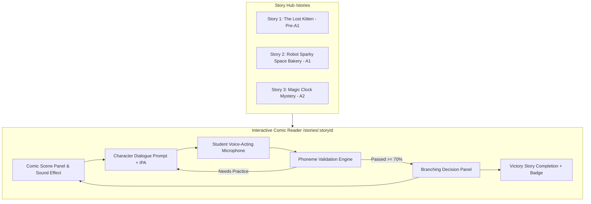

# Phase 17: Interactive Phonics Comic Storybooks & Voice-Acting Adventures Design

## 1. Context & Motivation

Reading comprehension and spoken fluency in English are most effectively developed when children are emotionally invested in a narrative. Passive reading or listening often leads to low retention. **Phase 17** introduces **Interactive Phonics Comic Storybooks & Voice-Acting Adventures (Truyện Tranh Tương Tác & Lồng Tiếng Nhân Vật)**:
- **Visual Comic Paneling**: Vivid manga/comic panels with emotive character illustrations, sound effect banners ("BOOM!", "WHOOSH!", "SQUEAK!"), and dual-language narrative captions.
- **Active Voice-Acting Gameplay**: Students do not merely tap "Next"—they step into the shoes of the characters! Speech bubbles light up, prompting students to record character dialogue into their microphone.
- **Phoneme-Aware Validation**: Integrated with Phase 14's granular phoneme evaluation engine (`src/lib/phoneme-evaluator.ts`), giving instantaneous tactile feedback on ending consonants and vowel accuracy.
- **Adaptive Branching Narrative**: Key dramatic decision points offer branching choices (e.g. *Help the fairy* vs *Inspect the mysterious door*), delivering replayability and agency.

---

## 2. Architecture & Flow Diagram

---

## 3. Data Contracts & Content Model

### 3.1 `ComicStory`
- `id: string`
- `title: string`
- `titleVi: string`
- `level: 'Pre-A1' | 'A1' | 'A2'`
- `coverEmoji: string`
- `themeColor: string`
- `synopsisVi: string`
- `focusPhonemes: string[]`
- `panels: ComicPanel[]`

### 3.2 `ComicPanel`
- `id: string`
- `panelNumber: number`
- `sceneEmoji: string`
- `narratorTextVi: string`
- `characterName: string`
- `characterAvatar: string`
- `dialogueEn: string`
- `dialogueIpa: string`
- `dialogueMeaningVi: string`
- `soundEffect?: string`
- `requiresVoiceActing: boolean`
- `branchChoices?: BranchChoice[]`

---

## 4. UI Components

1. **`StoryHub.tsx` (`/stories`)**:
   - Story cards with level badges, focus phoneme chips, and progress indicators.
2. **`ComicStoryReader.tsx` (`/stories/[storyId]`)**:
   - Fullscreen comic panel view with panel progress tracker.
   - Dynamic speech bubble with interactive TTS listen button and recording toggle.
   - Real-time phoneme feedback card with dropped-ending warnings.
   - Branching decision buttons with glowing hover effects.
3. **`StoryCompletedModal.tsx`**:
   - Celebratory completion modal awarding +25 EXP and Storyteller Star badge.

---

## 5. Strict Kid-Friendly Typography Policy

- Strict minimum 16px font size throughout student and comic reader components.
- Zero tolerance for `text-xs`, `text-sm`, `text-[10px]`, `text-[12px]`, `text-[14px]`.
- WCAG AA high contrast ratios.

---

## 6. Verification Strategy

1. **Unit Tests (Vitest)**:
   - Story narrative catalog validation and panel graph traversal.
   - Server action progression and EXP reward calculation.
2. **Component Tests (Vitest + Testing Library)**:
   - `ComicStoryReader.tsx`: dialogue rendering, mic trigger, branching choice handling.
   - `StoryHub.tsx`: story cards and level filtering.
3. **Playwright E2E Tests**:
   - Navigation from `/stories` to comic reader.
   - Typography compliance audit on story reader and comic hubs.
4. **Quality Gates**:
   - `npx tsc --noEmit`: 0 errors.
   - `npm run lint`: 0 warnings/errors.
   - `npm run test:run`: 100% passing.
   - `npm run build`: Turbopack build succeeded.
