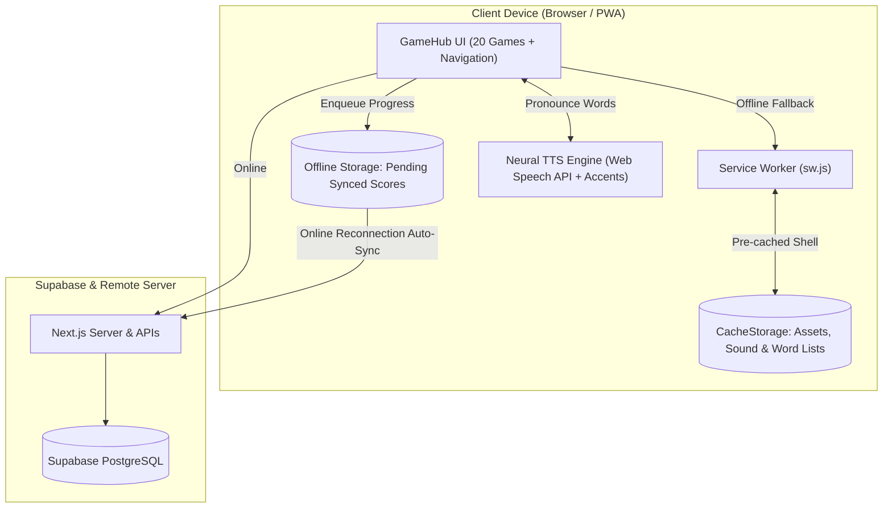

# Phase 11 Design Specification: PWA Offline & Multi-Accent Neural TTS Engine

## 1. Overview & Vision
Phase 11 transforms GameHub into a high-performance, installable **Progressive Web App (PWA)** equipped with **Offline Resilience** and an advanced **Multi-Accent Neural Speech Synthesis (TTS) Engine**. This enables seamless classroom learning in schools with intermittent internet connectivity, home tablet play without app store friction, and authentic English pronunciation practice with native US, UK, and Australian accents.

---

## 2. Core Functional Requirements

### FR-1: Web App Manifest & Install Experience
- **Manifest**: Generated dynamically via `src/app/manifest.ts` conforming to W3C Manifest specs.
- **Standalone Mode**: Configured with `display: "standalone"`, `theme_color: "#4f46e5"`, and custom icons for 192x192 and 512x512.
- **Install Banner (`InstallPromptBanner.tsx`)**:
  - Captures `beforeinstallprompt` event on Chromium browsers.
  - Detects iOS Mobile Safari and provides friendly visual instructions ("Bấm Chia sẻ -> Thêm vào Màn hình chính").
  - Includes dismiss option with 7-day cooldown persisted in `localStorage`.
  - Strict $\ge 16$px typography.

### FR-2: Service Worker & Offline Caching (`public/sw.js`, `ServiceWorkerRegister.tsx`)
- **Pre-cached Shell**: Caches static assets, app CSS/JS bundles, game datasets, CEFR word lists, and system icons.
- **Cache Strategies**:
  - Cache-First for static images, sound effects, and fonts.
  - Network-First with Cache Fallback for dynamic pages (`/games/*`, `/tenses/*`, `/parts-of-speech/*`).
  - Stale-While-Revalidate for vocabulary data.
- **Lifecycle Management**: Clean cache activation and old version invalidation upon updates (`gamehub-v1-offline-cache`).

### FR-3: Network Status & Offline Queue Engine (`useNetworkStatus.ts`, `OfflineIndicator.tsx`, `offline-manager.ts`)
- **Real-time Status**: Listens to browser `online` and `offline` events.
- **Offline Actions Queue**: Queues game session scores, stars, and quest progress in `localStorage` when offline.
- **Auto-Sync on Reconnect**: Automatically replays queued progress to Supabase when network connectivity returns.
- **Visual Pill**: Unobtrusive floating badge alerting students when offline ("Đang ở chế độ Offline - Bé vẫn học tốt!") and confirming when reconnected.

### FR-4: Multi-Accent Neural Speech Synthesis (`tts-engine.ts`, `useSpeech.ts`, `types/speech.ts`)
- **Accent Regions**:
  - `US`: American English (`en-US`)
  - `UK`: British English (`en-GB`)
  - `AU`: Australian English (`en-AU`)
- **Voice Styles**:
  - `kid`: Playful, clear enunciation (pitch: 1.15, rate: 0.75)
  - `natural`: Standard authentic native cadence (pitch: 1.0, rate: 0.85)
  - `slow`: Beginner-friendly, extra articulate pacing (pitch: 1.0, rate: 0.65)
- **Neural Voice Selection**: Automatically discovers and prioritizes high-fidelity online/neural voices (Google US English, Microsoft Jenny, Samantha, Daniel, Karen) over default robotic synthesizers.
- **Audio Cache**: Caches spoken utterances in memory and audio buffers to eliminate speech synthesis latency on repeated flashcard flips.

### FR-5: Voice & Audio Settings Studio (`SpeechSettingsModal.tsx`, `VoicePreviewButton.tsx`)
- Interactive modal accessible from the top navbar and in-game headers.
- Allows students and teachers to switch accents, voice styles, and adjust speed.
- Interactive voice preview with fun kid phrases ("Awesome job! Let's play together!").
- Global persistence in `localStorage` (`gamehub_speech_config`).

---

## 3. Architecture & Data Flow

---

## 4. Typography & Accessibility Guardrails
- **Kid-Friendly Typography**: Minimum 16px font size on all new user-facing components (`text-base` minimum; strictly zero `text-xs`, `text-sm`, `text-[10px]`, `text-[12px]`, `text-[14px]`).
- **High Contrast**: Dark/light mode adaptive borders, WCAG AA compliance.
- **ARIA Live**: Screen reader announcements for network status transitions.
