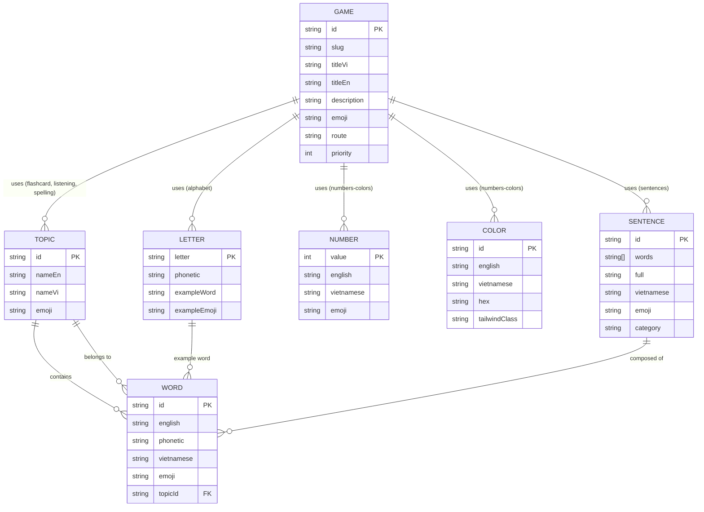
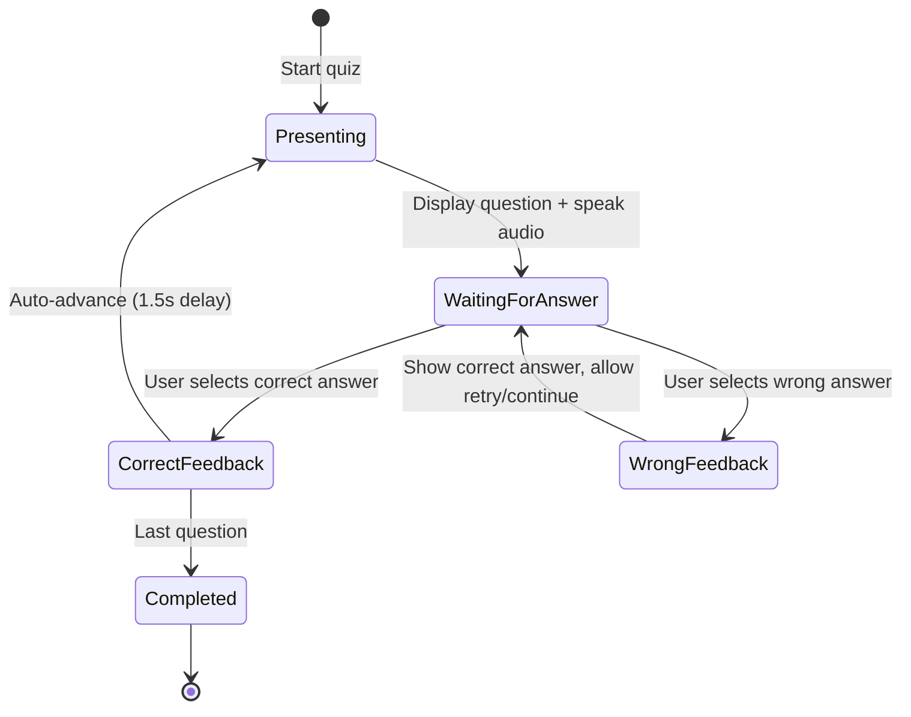
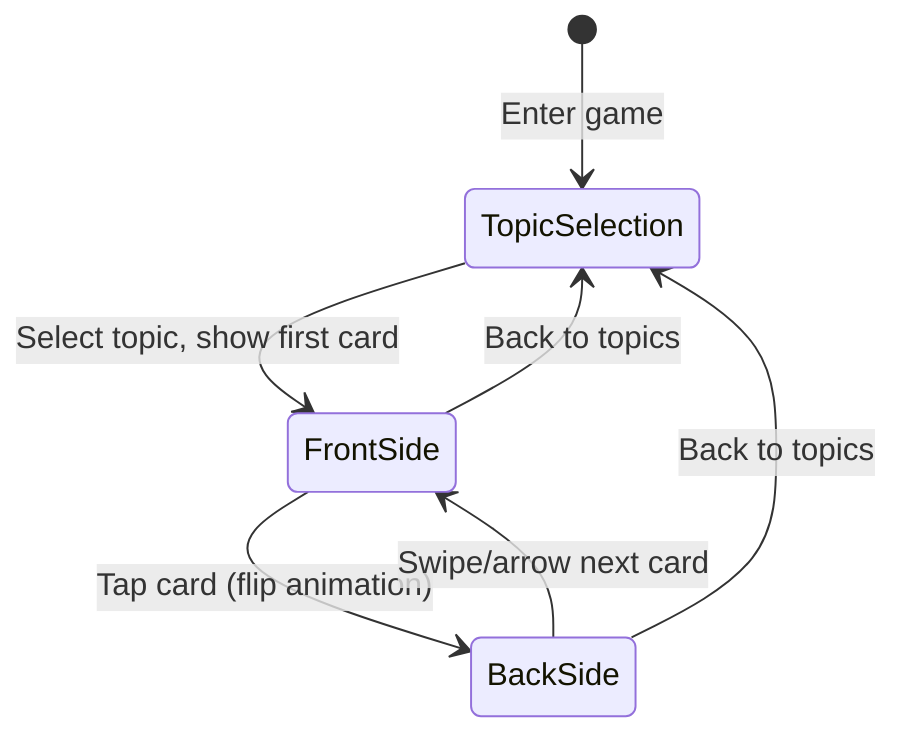
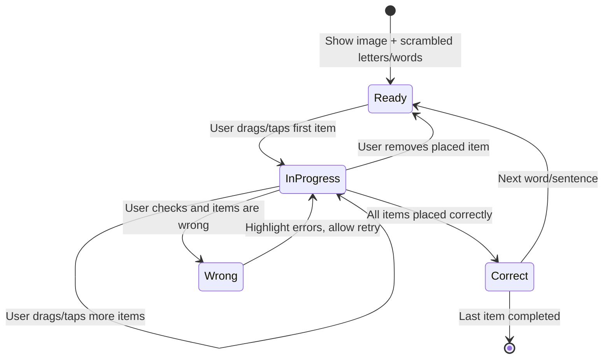

# Data Model: English Learning Games for Kids

**Feature Branch**: `001-english-learning-games` | **Date**: 2026-08-20

## Overview

All data is static JSON — no database, no ORM, no migrations. Data files are imported at build time by Server Components. Each entity maps to a TypeScript interface and a JSON data file in `src/data/`.

## Entity Diagram



## Entity Definitions

### Game

Represents one of the 6 learning games available on the hub.

| Field | Type | Description | Example |
|-------|------|-------------|---------|
| `id` | `string` | Unique identifier | `"flashcard"` |
| `slug` | `string` | URL-safe slug for routing | `"flashcard"` |
| `titleVi` | `string` | Vietnamese display name | `"Học từ vựng"` |
| `titleEn` | `string` | English display name | `"Flashcard"` |
| `description` | `string` | Short description in Vietnamese | `"Học từ vựng qua thẻ lật"` |
| `emoji` | `string` | System emoji illustration | `"🃏"` |
| `route` | `string` | App Router path | `"/games/flashcard"` |
| `priority` | `number` | Display order on homepage (1 = first) | `1` |

**Validation Rules**:
- `id` must be unique, lowercase alphanumeric + hyphens
- `slug` must be URL-safe (no spaces, special characters)
- `emoji` must be a single emoji or emoji sequence
- `priority` must be a positive integer, unique across games

**Fixed Values** (6 games):

| id | titleVi | emoji | priority |
|----|---------|-------|----------|
| `flashcard` | Học từ vựng | 🃏 | 1 |
| `alphabet` | Chữ cái & Phonics | 🔤 | 2 |
| `listening` | Nghe hiểu | 👂 | 3 |
| `spelling` | Đánh vần | ✏️ | 4 |
| `numbers-colors` | Số & Màu sắc | 🔢 | 5 |
| `sentences` | Câu đơn giản | 💬 | 6 |

---

### Topic

Groups vocabulary words by learning theme. Used by Flashcard, Listening, and Spelling games.

| Field | Type | Description | Example |
|-------|------|-------------|---------|
| `id` | `string` | Unique identifier | `"animals"` |
| `nameEn` | `string` | English name | `"Animals"` |
| `nameVi` | `string` | Vietnamese name | `"Động vật"` |
| `emoji` | `string` | Representative emoji | `"🐾"` |

**Validation Rules**:
- `id` must be unique, lowercase
- Minimum 5 topics required (FR-004)

**Required Topics** (minimum):

| id | nameEn | nameVi | emoji |
|----|--------|--------|-------|
| `animals` | Animals | Động vật | 🐾 |
| `fruits` | Fruits | Trái cây | 🍎 |
| `family` | Family | Gia đình | 👨‍👩‍👧‍👦 |
| `school` | School | Trường học | 🏫 |
| `body-parts` | Body Parts | Cơ thể | 🦶 |

---

### Word

A single English vocabulary word. Used across multiple games. Each word belongs to one topic.

| Field | Type | Description | Example |
|-------|------|-------------|---------|
| `id` | `string` | Unique identifier | `"cat"` |
| `english` | `string` | English word | `"Cat"` |
| `phonetic` | `string` | IPA phonetic transcription | `"/kæt/"` |
| `vietnamese` | `string` | Vietnamese translation | `"Con mèo"` |
| `emoji` | `string` | Emoji illustration | `"🐱"` |
| `topicId` | `string` | Foreign key to Topic | `"animals"` |

**Validation Rules**:
- `id` must be unique across all words
- `topicId` must reference a valid Topic `id`
- Each topic must have at least 10 words (SC-006)
- Total words across all topics ≥ 50 (SC-006)
- `english` should be simple words appropriate for 6-7 year olds
- Words used in Spelling game should have 3-5 letters max

---

### Letter

One of the 26 English alphabet letters with phonetic info and example word.

| Field | Type | Description | Example |
|-------|------|-------------|---------|
| `letter` | `string` | Uppercase letter (A-Z) | `"B"` |
| `phonetic` | `string` | Letter sound description | `"/biː/"` |
| `exampleWord` | `string` | Example word starting with this letter | `"Ball"` |
| `exampleEmoji` | `string` | Emoji for the example word | `"⚽"` |

**Validation Rules**:
- Exactly 26 entries (A through Z)
- `letter` must be single uppercase ASCII letter
- `exampleWord` must start with the corresponding letter

---

### Number

A counting number (1-20) with English name and illustration.

| Field | Type | Description | Example |
|-------|------|-------------|---------|
| `value` | `number` | Numeric value (1-20) | `3` |
| `english` | `string` | English name | `"Three"` |
| `vietnamese` | `string` | Vietnamese name | `"Ba"` |
| `emoji` | `string` | Emoji repeated `value` times for illustration | `"🍎🍎🍎"` |

**Validation Rules**:
- Exactly 20 entries (1 through 20)
- `value` must be integer 1-20
- `emoji` string length should visually represent the count

---

### Color

A basic color with English/Vietnamese names and visual representation.

| Field | Type | Description | Example |
|-------|------|-------------|---------|
| `id` | `string` | Unique identifier | `"red"` |
| `english` | `string` | English name | `"Red"` |
| `vietnamese` | `string` | Vietnamese name | `"Đỏ"` |
| `hex` | `string` | Hex color code | `"#FF0000"` |
| `tailwindClass` | `string` | Tailwind bg class | `"bg-red-500"` |

**Validation Rules**:
- Minimum 8 colors (FR-010)
- `hex` must be valid 6-digit hex color code
- `tailwindClass` must be valid Tailwind CSS class

**Required Colors** (minimum 8):

| id | english | vietnamese | hex |
|----|---------|-----------|-----|
| `red` | Red | Đỏ | `#EF4444` |
| `blue` | Blue | Xanh dương | `#3B82F6` |
| `green` | Green | Xanh lá | `#22C55E` |
| `yellow` | Yellow | Vàng | `#EAB308` |
| `orange` | Orange | Cam | `#F97316` |
| `purple` | Purple | Tím | `#A855F7` |
| `pink` | Pink | Hồng | `#EC4899` |
| `brown` | Brown | Nâu | `#92400E` |
| `black` | Black | Đen | `#000000` |
| `white` | White | Trắng | `#FFFFFF` |

---

### Sentence

A simple English sentence for the sentence-building game.

| Field | Type | Description | Example |
|-------|------|-------------|---------|
| `id` | `string` | Unique identifier | `"i-am-eating"` |
| `words` | `string[]` | Ordered array of words | `["I", "am", "eating"]` |
| `full` | `string` | Complete sentence | `"I am eating"` |
| `vietnamese` | `string` | Vietnamese translation | `"Tôi đang ăn"` |
| `emoji` | `string` | Situation illustration | `"🍽️"` |
| `category` | `string` | Sentence pattern category | `"daily-actions"` |

**Validation Rules**:
- `words` array must contain 2-5 words (simple sentences for 6-7 year olds)
- `words` joined by spaces must equal `full`
- Each sentence should use vocabulary appropriate for grade 1-2
- Minimum 10 sentences across all categories

---

## State Transitions

### Quiz Mode State Machine

Used by Alphabet, Listening, and Numbers & Colors games when in quiz mode.



### Flashcard State Machine



### Spelling / Sentence Building State Machine



## JSON Data File Structure

```text
src/data/
├── games.json          # Game[] — 6 games
├── topics.json         # Topic[] — 5+ topics
├── words/
│   ├── animals.json    # Word[] — words for animals topic
│   ├── fruits.json     # Word[] — words for fruits topic
│   ├── family.json     # Word[] — words for family topic
│   ├── school.json     # Word[] — words for school topic
│   └── body-parts.json # Word[] — words for body parts topic
├── letters.json        # Letter[] — 26 letters
├── numbers.json        # Number[] — 20 numbers
├── colors.json         # Color[] — 10 colors
└── sentences.json      # Sentence[] — 10+ sentences
```

## TypeScript Interfaces

```typescript
// src/types/index.ts

export interface Game {
  id: string;
  slug: string;
  titleVi: string;
  titleEn: string;
  description: string;
  emoji: string;
  route: string;
  priority: number;
}

export interface Topic {
  id: string;
  nameEn: string;
  nameVi: string;
  emoji: string;
}

export interface Word {
  id: string;
  english: string;
  phonetic: string;
  vietnamese: string;
  emoji: string;
  topicId: string;
}

export interface Letter {
  letter: string;
  phonetic: string;
  exampleWord: string;
  exampleEmoji: string;
}

export interface GameNumber {
  value: number;
  english: string;
  vietnamese: string;
  emoji: string;
}

export interface Color {
  id: string;
  english: string;
  vietnamese: string;
  hex: string;
  tailwindClass: string;
}

export interface Sentence {
  id: string;
  words: string[];
  full: string;
  vietnamese: string;
  emoji: string;
  category: string;
}
```
