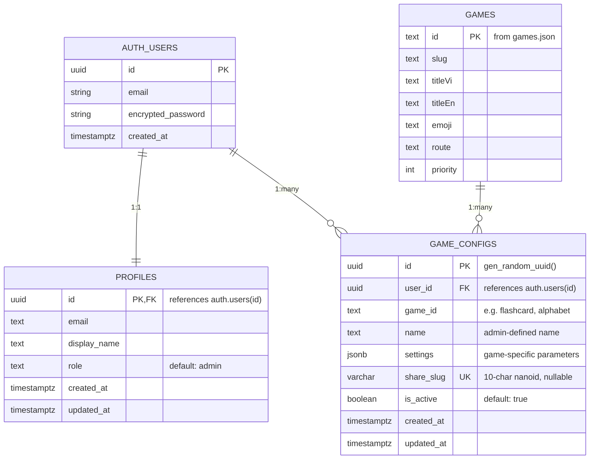
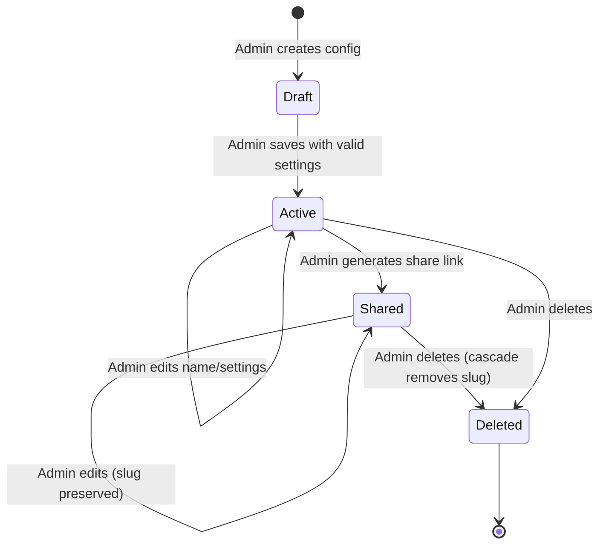

# Data Model: Quản lý Tài khoản & Cấu hình Game

**Date**: 2026-08-21
**Feature**: 002-game-config-management

## Entity Relationship Diagram



> **Note**: `GAMES` is a static JSON entity (`src/data/games.json`), not a database table. `game_id` in `GAME_CONFIGS` references game IDs by convention (validated at application level), not by foreign key.

## Entity Definitions

### 1. profiles

Extends `auth.users` with application-specific metadata.

| Column | Type | Constraints | Description |
|--------|------|-------------|-------------|
| `id` | UUID | PK, FK → `auth.users(id)` ON DELETE CASCADE | Matches auth user ID |
| `email` | TEXT | NOT NULL | Synced from auth user |
| `display_name` | TEXT | nullable | Teacher's display name |
| `role` | TEXT | NOT NULL, DEFAULT 'admin' | User role (single role for now) |
| `created_at` | TIMESTAMPTZ | NOT NULL, DEFAULT now() | Record creation time |
| `updated_at` | TIMESTAMPTZ | NOT NULL, DEFAULT now() | Last modification time |

**Validation Rules**:
- `display_name`: max 100 characters
- `role`: must be 'admin' (only supported value for v1)

**Triggers**:
- Auto-create profile on `auth.users` insert (via Supabase trigger function)
- Auto-update `updated_at` on modification

---

### 2. game_configs

Stores custom game configurations created by admins.

| Column | Type | Constraints | Description |
|--------|------|-------------|-------------|
| `id` | UUID | PK, DEFAULT gen_random_uuid() | Configuration identifier |
| `user_id` | UUID | NOT NULL, FK → `auth.users(id)` ON DELETE CASCADE | Owner admin |
| `game_id` | TEXT | NOT NULL | Game identifier (e.g. 'flashcard') |
| `name` | TEXT | NOT NULL | Admin-defined config name |
| `settings` | JSONB | NOT NULL, DEFAULT '{}' | Game-specific parameters |
| `share_slug` | VARCHAR(32) | UNIQUE, nullable | Share link slug (generated on share) |
| `is_active` | BOOLEAN | NOT NULL, DEFAULT true | Soft delete / deactivation flag |
| `created_at` | TIMESTAMPTZ | NOT NULL, DEFAULT now() | Record creation time |
| `updated_at` | TIMESTAMPTZ | NOT NULL, DEFAULT now() | Last modification time |

**Indexes**:
- `idx_game_configs_share_slug` on `(share_slug)` WHERE `share_slug IS NOT NULL` — fast public lookup
- `idx_game_configs_user_game` on `(user_id, game_id)` — admin dashboard listing

**Validation Rules**:
- `name`: 1-200 characters, required
- `game_id`: must match one of the 6 known game IDs
- `settings`: validated against game-specific schema at application level
- `share_slug`: exactly 10 characters when present, generated by nanoid

**State Transitions**:


> **Note**: "Draft", "Active", "Shared" are logical states, not stored values. "Draft" = unsaved form. "Active" = `is_active = true, share_slug IS NULL`. "Shared" = `is_active = true, share_slug IS NOT NULL`. "Deleted" = row removed from database (hard delete via RLS policy).

---

## Settings JSONB Schema (Per-Game)

### flashcard

```typescript
interface FlashcardSettings {
  topics: string[]      // Selected topic IDs, e.g. ["animals", "fruits"]
  wordLimit: number     // Max words per topic (0 = all)
  autoSpeak: boolean    // Auto-pronounce word on card flip
}
```

### alphabet

```typescript
interface AlphabetSettings {
  letterRange: string[] // Subset of letters, e.g. ["A","B","C"]
  mode: 'learn' | 'quiz'
  autoSpeak: boolean
}
```

### listening

```typescript
interface ListeningSettings {
  topics: string[]      // Selected topic IDs
  questionCount: number // Questions per session (0 = all)
  showHint: boolean     // Show emoji hint during listening
}
```

### spelling

```typescript
interface SpellingSettings {
  topics: string[]      // Selected topic IDs
  wordLimit: number     // Words per session (0 = all)
  showEmoji: boolean    // Show emoji hint while spelling
}
```

### numbers-colors

```typescript
interface NumbersColorsSettings {
  numberRange: [number, number] // Min-max range, e.g. [1, 10]
  includeColors: boolean        // Include color learning
  mode: 'learn' | 'quiz'
}
```

### sentences

```typescript
interface SentencesSettings {
  categories: string[]   // Selected sentence categories
  sentenceCount: number  // Sentences per session (0 = all)
  showVietnamese: boolean // Show Vietnamese translation hint
}
```

### Discriminated Union Type

```typescript
type GameSettings =
  | { gameId: 'flashcard'; settings: FlashcardSettings }
  | { gameId: 'alphabet'; settings: AlphabetSettings }
  | { gameId: 'listening'; settings: ListeningSettings }
  | { gameId: 'spelling'; settings: SpellingSettings }
  | { gameId: 'numbers-colors'; settings: NumbersColorsSettings }
  | { gameId: 'sentences'; settings: SentencesSettings }
```

---

## SQL Schema

See [research.md](file:///F:/projects/gamehub/specs/002-game-config-management/research.md#r2-supabase-database-schema--rls) for complete SQL including:
- Table creation statements
- Index definitions
- RLS policies (admin CRUD + public read for shared configs)
- Trigger functions for profile auto-creation and `updated_at`

## Row Level Security Summary

| Table | Operation | Role | Policy |
|-------|-----------|------|--------|
| profiles | SELECT | authenticated | `auth.uid() = id` |
| profiles | UPDATE | authenticated | `auth.uid() = id` |
| game_configs | SELECT | authenticated | `auth.uid() = user_id` |
| game_configs | INSERT | authenticated | `auth.uid() = user_id` |
| game_configs | UPDATE | authenticated | `auth.uid() = user_id` |
| game_configs | DELETE | authenticated | `auth.uid() = user_id` |
| game_configs | SELECT | anon + authenticated | `share_slug IS NOT NULL AND is_active = true` |
