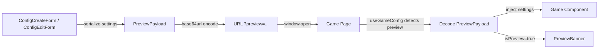

# Data Model: Preview Game Configuration

**Feature**: 003-preview-game-config | **Date**: 2026-08-22

## Overview

The preview feature introduces **no new database entities**. It is entirely stateless, passing settings via URL-encoded query parameters. This document describes the in-memory data structures and the encoding format.

## Entities

### PreviewPayload (new — in-memory only)

The serialized payload embedded in the URL query parameter `preview`.

| Field | Type | Required | Description |
|-------|------|----------|-------------|
| `gameId` | `GameId` | Yes | Identifies which game type this payload is for. Used for validation on the receiving end. |
| `settings` | `AnyGameSettings` | Yes | The game-specific settings object matching the `gameId`. Uses the same typed structures as saved configs. |

**TypeScript definition** (in `src/types/config.ts`):

```typescript
export interface PreviewPayload {
  gameId: GameId
  settings: AnyGameSettings
}
```

**Serialization format**:
1. `JSON.stringify(payload)` → JSON string
2. `btoa(jsonString)` → base64 string (using `TextEncoder` for Unicode safety)
3. Replace `+` → `-`, `/` → `_`, strip trailing `=` → URL-safe base64
4. Result is passed as `?preview=<encoded>` query parameter

**Example**:
```
Input:  { gameId: "flashcard", settings: { topics: ["animals"], wordLimit: 5, autoSpeak: false } }
JSON:   {"gameId":"flashcard","settings":{"topics":["animals"],"wordLimit":5,"autoSpeak":false}}
Base64: eyJnYW1lSWQiOiJmbGFzaGNhcmQiLCJzZXR0aW5ncyI6eyJ0b3BpY3MiOlsiYW5pbWFscyJdLCJ3b3JkTGltaXQiOjUsImF1dG9TcGVhayI6ZmFsc2V9fQ
URL:    /games/flashcard?preview=eyJnYW1lSWQiOiJmbGFzaGNhcmQiLCJzZXR0aW5ncyI6eyJ0b3BpY3MiOlsiYW5pbWFscyJdLCJ3b3JkTGltaXQiOjUsImF1dG9TcGVhayI6ZmFsc2V9fQ
```

### UseGameConfigResult (modified — existing)

The return type of the `useGameConfig` hook gains one new field:

| Field | Type | Change | Description |
|-------|------|--------|-------------|
| `config` | `GameConfig<T> \| null` | Existing | Full config object; in preview mode, synthesized from decoded payload |
| `settings` | `T \| null` | Existing | Extracted settings; in preview mode, decoded from URL |
| `configName` | `string \| null` | Existing | Config name; in preview mode, always `null` |
| `configId` | `string \| null` | Existing | Config ID; in preview mode, always `null` |
| `isLoading` | `boolean` | Existing | Loading state; in preview mode, always `false` (sync decode) |
| `isPreview` | `boolean` | **NEW** | `true` when settings were decoded from a `preview` query parameter |

### GameConfig (existing — no changes)

```typescript
interface GameConfig<T> {
  id: string
  user_id: string
  game_id: string
  name: string
  settings: T
  share_slug: string | null
  is_active: boolean
  created_at: string
  updated_at: string
}
```

In preview mode, a synthetic `GameConfig` is created with:
- `id`: `"preview"`
- `user_id`: `"preview"`
- `game_id`: from decoded `gameId`
- `name`: `"Xem trước"`
- `settings`: from decoded payload
- `share_slug`: `null`
- `is_active`: `true`
- `created_at`/`updated_at`: current ISO timestamp

## Relationships



## Validation Rules

1. **Encoding**: `PreviewPayload` MUST contain a valid `gameId` from the `GameId` union type
2. **Decoding**: The `gameId` in the decoded payload MUST match the `expectedGameId` passed to `useGameConfig`; mismatch → treat as no config
3. **Settings validation**: Settings are validated via `validateGameSettings()` **before encoding** (at the form side), not after decoding (the game page trusts the payload is pre-validated)
4. **Decode failure**: If base64 decoding or JSON parsing fails, the hook silently ignores the `preview` parameter and falls back to normal behavior (no config loaded)

## State Transitions

The preview feature has no persistent state transitions. It is a stateless, read-only operation:

```
Admin fills form → clicks "Chơi thử" → validate settings
  → VALID: encode → open new tab → game loads with preview settings
  → INVALID: show validation errors on form, no tab opened
```

## No Database Changes

- **No new tables**: Preview data is never persisted
- **No new columns**: Existing `game_configs` table is unchanged
- **No new RLS policies**: Preview bypasses the database entirely
- **No migrations needed**: Zero database impact (SC-005)
