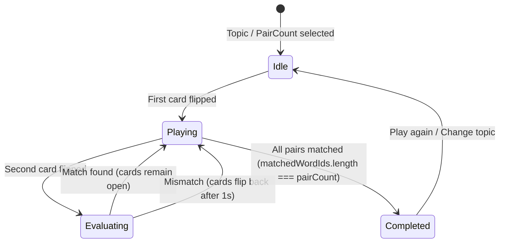

# Data Model: Memory Match Game (Trò chơi Lật Thẻ Tìm Cặp)

## Domain Entities

### MemoryCard
Represents an individual card rendered on the memory match board.

```typescript
export type MemoryCardType = 'emoji' | 'word';

export interface MemoryCard {
  id: string;              // Unique card identifier, e.g. "card-animal-cat-emoji"
  wordId: string;          // Identifier of source Word, e.g. "animal-cat"
  type: MemoryCardType;    // 'emoji' (visual card) | 'word' (English text card)
  content: string;         // Emoji character (e.g. "🐱") or English text (e.g. "Cat")
  english: string;         // English word used for text-to-speech pronunciation
  phonetic?: string;       // Phonetic pronunciation guide, e.g. "/kæt/"
  vietnamese?: string;     // Vietnamese meaning, e.g. "Con mèo"
  isFlipped: boolean;      // True if card is currently flipped face-up
  isMatched: boolean;      // True if card has been matched and remains open
}
```

### MemoryGameState
Runtime state managed by `useMemoryGame` custom hook during an active session.

```typescript
export interface MemoryGameState {
  status: 'idle' | 'playing' | 'completed';
  topicId: string;
  pairCount: 4 | 6 | 8;
  cards: MemoryCard[];
  flippedIndices: number[];     // Max length: 2 during evaluation
  matchedWordIds: string[];     // IDs of successfully paired words
  flips: number;                // Count of flip attempts (turns)
  isLocked: boolean;            // True while delaying mismatch flip-back (locks clicks)
  elapsedSeconds: number;       // Playtime elapsed
  stars: 1 | 2 | 3;             // Rating computed when completed
}
```

## Admin Configuration Entity

### MemoryMatchSettings (`src/types/config.ts`)

```typescript
export interface MemoryMatchSettings {
  topics: string[];             // Allowed topics, e.g. ["animals", "fruits"]
  pairCount: 4 | 6 | 8;         // Number of pairs per game session (default: 6)
  autoSpeak: boolean;           // True to auto-pronounce when word card flips
  showTimer: boolean;           // True to display elapsed timer during gameplay
}
```

## State Transitions


