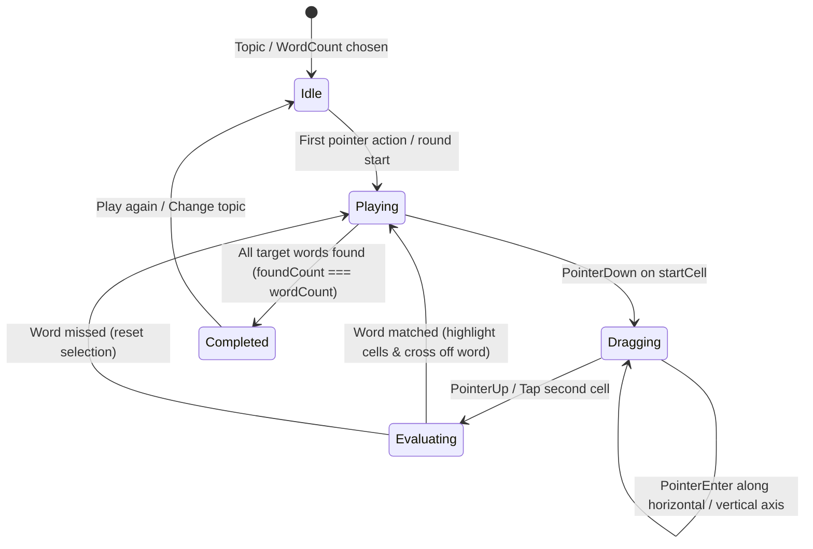

# Data Model: Word Search Game (Trò chơi Săn Tìm Từ Vựng)

**Feature**: `027-word-search-game` | **Date**: 2026-09-07

## Domain Entities

### Coordinate
Represents a row and column location on the 8x8 grid (0-indexed).

```typescript
export interface Coordinate {
  row: number; // 0 to 7
  col: number; // 0 to 7
}
```

### WordSearchCell
Represents an individual character cell rendered on the 8x8 letter board.

```typescript
export interface WordSearchCell {
  id: string;               // Unique coordinate identifier, e.g. "cell-r2-c4"
  row: number;              // 0 to 7
  col: number;              // 0 to 7
  letter: string;           // Single uppercase English letter ('A' - 'Z')
  isSelected: boolean;      // True if part of the current active drag/tap selection
  isHinted: boolean;        // True while pulsing as a hint starting letter
  matchedColors: string[];  // Array of pastel colors for completed words covering this cell
}
```

### WordSearchTargetWord
Represents a vocabulary word to be discovered on the board.

```typescript
export type WordSearchDirection = 'horizontal' | 'vertical';

export interface WordSearchTargetWord {
  id: string;                    // Word ID, e.g. "animals-cat"
  english: string;               // Normalized uppercase English word (e.g. "CAT")
  vietnamese: string;            // Vietnamese definition (e.g. "Con mèo")
  emoji: string;                 // Visual emoji representation (e.g. "🐱")
  phonetic?: string;             // Phonetic guide (e.g. "/kæt/")
  direction: WordSearchDirection;// 'horizontal' (L→R) | 'vertical' (T→B)
  coordinates: Coordinate[];     // Sequence of coordinates on the 8x8 board
  isFound: boolean;              // True once successfully selected by player
  color: string;                 // Assigned unique pastel theme color hex
}
```

### WordSearchGameState
Runtime state managed by `useWordSearchGame` custom hook during gameplay.

```typescript
export interface WordSearchGameState {
  status: 'idle' | 'playing' | 'completed';
  topicId: string;
  wordCount: 4 | 5 | 6;
  grid: WordSearchCell[][];              // 8x8 matrix
  targetWords: WordSearchTargetWord[];   // Target word list
  selectedCoordinates: Coordinate[];     // Active drag/tap cell path
  startCoordinate: Coordinate | null;    // Origin coordinate of current drag/tap
  hintedCoordinate: Coordinate | null;   // Origin coordinate of active hint
  hintCount: number;                     // Total hint requests used in round
  elapsedSeconds: number;                // Gameplay elapsed time
  stars: 1 | 2 | 3;                      // Final rating computed on win
}
```

---

## Admin Configuration Entity

### WordSearchSettings (`src/types/config.ts`)

```typescript
export interface WordSearchSettings {
  topics: string[];         // Allowed topic IDs, e.g. ["animals", "fruits"]
  wordCount: 4 | 5 | 6;     // Number of words per round (default: 5)
  enableHints: boolean;     // Enable/disable the 💡 hint button (default: true)
  autoSpeak: boolean;       // Auto-speak English word on correct match (default: true)
  showTimer: boolean;       // Display elapsed stopwatch during gameplay (default: true)
}
```

---

## State Transitions


