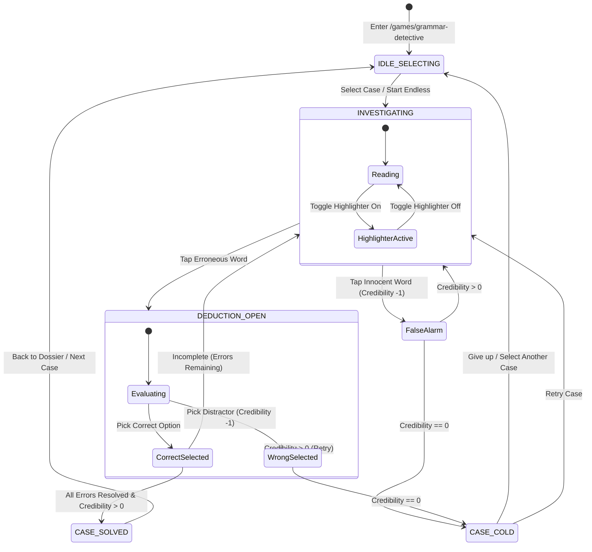

# Data Model: Grammar Detective Game

**Feature**: `028-grammar-detective`
**Status**: Approved
**Date**: 2026-09-08

---

## 1. Entity Definitions

### 1.1 `CaseFile`
Represents an investigative dossier containing a document to be audited.

| Field | Type | Required | Description |
|---|---|---|---|
| `id` | `string` | Yes | Unique identifier (e.g., `case-email-01`) |
| `title` | `string` | Yes | English case title (e.g., `Urgent Release Deployment`) |
| `titleVi` | `string` | Yes | Vietnamese case title (e.g., `Báo cáo triển khai khẩn cấp`) |
| `category` | `'email' \| 'incident' \| 'chat' \| 'social'` | Yes | Scenario context category |
| `rankTier` | `'intern' \| 'junior' \| 'senior' \| 'chief'` | Yes | Detective difficulty tier |
| `sender` | `string` | Yes | Author of the document (e.g., `alex.dev@corp.com`) |
| `recipient` | `string` | Yes | Recipient of the document (e.g., `all-engineering@corp.com`) |
| `subject` | `string` | Yes | Subject line / Topic summary |
| `documentText` | `string` | Yes | Full verbatim text containing deliberate grammatical errors |
| `errors` | `CaseError[]` | Yes | Array of error annotations present in this document |

---

### 1.2 `CaseError`
Annotates a specific grammatical, prepositional, or lexical slip-up within the document text.

| Field | Type | Required | Description |
|---|---|---|---|
| `id` | `string` | Yes | Unique error ID (e.g., `err-01-tense`) |
| `targetWord` | `string` | Yes | The erroneous word or phrase as it appears in the text |
| `tokenIndex` | `number` | Yes | The 0-based word-token index where this error occurs |
| `errorType` | `'tense' \| 'preposition' \| 'collocation' \| 'politeness' \| 'spelling'` | Yes | Grammatical classification |
| `options` | `ErrorOption[]` | Yes | 3-4 multiple choice alternatives (1 correct, 2-3 distractors) |
| `explanationEn` | `string` | Yes | English explanation of the grammar rule |
| `explanationVi` | `string` | Yes | Vietnamese explanation of the grammar rule |

---

### 1.3 `ErrorOption`
A candidate choice inside the Deduction Card.

| Field | Type | Required | Description |
|---|---|---|---|
| `id` | `string` | Yes | Option ID (e.g., `opt-a`) |
| `text` | `string` | Yes | Candidate replacement text |
| `isCorrect` | `boolean` | Yes | True if this is the correct fix |
| `feedbackEn` | `string` | Yes | Rationale explaining why this option is right or wrong |
| `feedbackVi` | `string` | Yes | Vietnamese rationale |

---

### 1.4 `TextToken`
A runtime segment produced by the tokenizer for rendering the interactive document.

| Field | Type | Required | Description |
|---|---|---|---|
| `index` | `number` | Yes | Sequential token index |
| `rawText` | `string` | Yes | Text string slice |
| `isWord` | `boolean` | Yes | True if segment consists of alphanumeric word characters |
| `errorId` | `string \| null` | Yes | Associated error ID if this token represents an error |
| `isCorrected` | `boolean` | Yes | True once the player has successfully fixed this error |

---

### 1.5 `DetectiveSession`
Live game session state managed during active investigation.

| Field | Type | Required | Description |
|---|---|---|---|
| `mode` | `'case' \| 'endless'` | Yes | Active game mode |
| `caseId` | `string` | Yes | Current case file identifier |
| `credibility` | `number` | Yes | Remaining health/lives (initial: 3, range: 0-3) |
| `maxCredibility` | `number` | Yes | Initial credibility (default: 3) |
| `solvedErrorIds` | `string[]` | Yes | IDs of errors successfully resolved |
| `mistakeCount` | `number` | Yes | Number of incorrect taps/distractor selections |
| `status` | `'selecting' \| 'investigating' \| 'deducing' \| 'solved' \| 'cold'` | Yes | Current state of the game loop |
| `activeErrorId` | `string \| null` | Yes | Error currently being inspected in the Deduction Card |
| `startTime` | `number` | Yes | Timestamp of case start |
| `elapsedSeconds` | `number` | Yes | Active play duration |
| `starsEarned` | `number` | Yes | 1 to 3 stars upon completion (0 if cold) |

---

### 1.6 `DetectiveRank`
Progression rank standing.

| Tier | Name | Title (Vi) | Required Solved Cases |
|---|---|---|---|
| `intern` | Intern Detective | Thám tử Tập sự | 0 (unlocked by default) |
| `junior` | Junior Investigator | Điều tra viên Sơ cấp | 3 solved cases |
| `senior` | Senior Inspector | Thanh tra Trung cấp | 6 solved cases |
| `chief` | Chief Detective | Đại thám tử Trưởng | 9 solved cases |

---

## 2. State Transitions

---

## 3. Validation Rules

1. **Case Integrity**:
   - Every `CaseFile` must have at least 1 and at most 5 `CaseError` annotations.
   - `tokenIndex` in each `CaseError` must match the exact position of `targetWord` in the tokenized `documentText`.
   - Each `CaseError` must have exactly 1 option with `isCorrect: true` and 2 to 3 options with `isCorrect: false`.
2. **Session Scoring**:
   - 3 stars awarded if completed with 3 remaining Credibility points (0 mistakes).
   - 2 stars awarded if completed with 2 remaining Credibility points (1 mistake).
   - 1 star awarded if completed with 1 remaining Credibility point (2 mistakes).
   - 0 stars and failure status if Credibility hits 0.
3. **Storage Sanitization**:
   - Local storage keys are scoped with version prefixes (`gamehub_grammar_detective_v1`).
   - Incomplete sessions do not corrupt overall high score or completed case lists.
